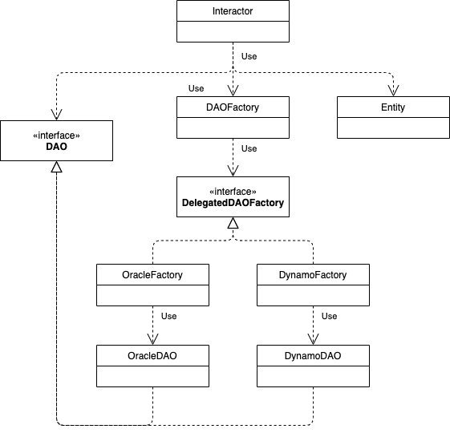

# Lineamientos para desarrollar

## Ambiente
En esta sección se describe un metodo de desarrollo que levanta la aplicación en un contenedor Docker lo cual hace que levantar la aplicación sea rapido.

(se recomienda evaluar usar [Spring Boot](https://spring.io/projects/spring-boot) en el futuro pues ayudaría a mejorar este método)

### Requerimientos

Para comenzar a desarrollar usando este metodo se requiere lo siguiente:

1. Java 8
2. Maven
3. [Docker](https://docs.docker.com/engine/install)
4. Terminal con Bash Shell (para Windows 10 se recomienda usar [Windows Subsystem for Linux](https://docs.microsoft.com/en-us/windows/wsl/install-win10))

### Uso

Para compilar, generar el contenedor Docker y levantarlo se debe ejecutar el siguiente script:

```
$ ./run-development.sh
```

Este script hace lo siguiente:

1. Compila el archivo WAR
2. Genera un contenedor docker usando Tomcat 7 con el archivo WAR
3. Levanta el contenedor docker
4. Abre un navegador con (o escribe escribe en consola) la URL para acceder a la aplicación
5. Abre una consola dentro del contenedor donde se puede acceder a los logs y todo el ambiente de Tomcat
6. Al salir de la consola del contenedor (con el comando `exit`) el script baja el contendor

## Agregar una vista y controlador

Para agregar una vista y controlador se deben crear un archivo llamado `NombreController.java` en la ruta `src/java/com/grupobios/bioslis/controller/` que correspodne al controlador y otro llamado `Nombre.jsp` en la ruta `src/webapp/WEB-INF/jsp/` que corresponde a la vista. Para ambos archivos `Nombre` debe ser reemplazado por el nombre de la vista/controlador.

Además de lo anterior se deben agregar las siguientes lineas en el archivo `src/webapp/WEB-INF/dispatcher-servlet.xml`:

```xml
    <bean id="urlMapping" class="org.springframework.web.servlet.handler.SimpleUrlHandlerMapping">
        <property name="mappings">
            <props>
                ...
                <prop key="/Nombre">nombre</prop> <!--agregar esta linea 1-->
                ...
            </props>
        </property>
    </bean>
```

```xml

    <bean id="multipartResolver"
          class="org.springframework.web.multipart.commons.CommonsMultipartResolver" />
    ...
    <bean name="microbiologia" class="com.grupobios.bioslis.microbiologia.controller.MicrobiologiaController"/> <!--agregar esta linea 2-->
    ...
    <mvc:resources mapping="/resources/**" location="/resources/" />
    <mvc:annotation-driven />

```

En el ejempo anterior see sigue con el ejemplo donde el controlador se llama `Nombre`.

A continuación se muestra un ejemplo del archivo para un controlador donde el controlador se llama `Microbiologia`:

```java
package com.grupobios.bioslis.controller;

import org.springframework.stereotype.Controller;
import org.springframework.web.servlet.ModelAndView;
import org.springframework.web.bind.annotation.RequestMapping;

@Controller
public class MicrobiologiaController {
 
    ModelAndView mav = new ModelAndView();

    @RequestMapping("/Microbiologia")
    public ModelAndView pageLoad() {
        mav.addObject("someVariable", "Vista de microbiología");
        mav.setViewName("Microbiologia");
        return mav;
    }
    
}
````

y su respectiva vista sería:

```jsp
<%@ taglib prefix="c" uri="http://java.sun.com/jsp/jstl/core" %>
<%@ taglib prefix="form" uri="http://www.springframework.org/tags/form"%>
<%@ taglib prefix="spring" uri="http://www.springframework.org/tags"%>

<%@page contentType="text/html" pageEncoding="UTF-8"%>
<!DOCTYPE html>
<html>
    <head>
        <jsp:include page="styles.jsp"/>
        <title>Microbiologia</title>
    </head>
    <body id="kt_body" class="header-fixed header-mobile-fixed subheader-enabled subheader-fixed aside-enabled aside-fixed aside-minimize-hoverable aside-minimize">
        <jsp:include page="SideBar.jsp"/>

        <div class="container mt-5">
            ${someVariable}
        </div>
        
        <jsp:include page="scripts.jsp"/>
    </body>
</html>
```

en el ejemplo de la vista anterior es importante tener el cuenta las siguientes lineas pues sirven para modularizar las vistas pues corresponden a elementos compratidos a través de la aplicación:

1. `<jsp:include page="styles.jsp"/>`: Agrega los estilos de la aplicación a la vista respectiva.
2. `<jsp:include page="SideBar.jsp"/>`: Agrega el sidebar que es compartido por toda la aplicación.
3. `<jsp:include page="scripts.jsp"/>`: Agrega los scripts Javascript que son comunes a la aplicación.

Estos archivos JSP base se encuentran en la misma ruta de los otros archivos JSP. Es recomendable en caso de tener vistas que puedan ser reutilizadas generar los archvios JSP y usarlos de esta manera,

## Testing

Para testing se ha implementado [JUnit](https://www.junit.org). Los test debe ir en la carpeta `src/test/java` y para ejecutarlos se debe usar el comando `mvn test`.

## Data access object (DAO) y Dependency injection (DI)

Las clases base de BiosLis (que no deben depender de ninguna otra clase) son las entidades y que estan en el paquete `com.grupobios.bioslis.entity`, para acceder a una entidad se utiliza el [patron de diseño DAO](https://en.wikipedia.org/wiki/Data_access_object) y por lo tanto cada entidad debe tener asociada una iterfaz DAO en el paquete `com.grupobios.bioslis.dao`.

Cada entidad debe tener una clase concreta que implemente su interfaz DAO para cada tipo de persistencia que se utilice. Tipicamente serán los _interactors_ o logicas de negocios quienes deban utilizar las entidades y por lo tanto llamarlas usando su respectivo DAO, para crear los respectivos DAO (dependiendo de la persistencia que se quiera usar) en los _interactors_ se utilizará una [DI](https://en.wikipedia.org/wiki/Dependency_injection) usando un [Abstract Factory](https://en.wikipedia.org/wiki/Abstract_factory_pattern). Para esto se usa una clase `DAOFactory` que delega a otra _Factory_ que depende de la persistencia.

En la siguiente imagen se muestra un diagrama de la arquitectura descrita:



Actualmente en la clase `DAOFactory` que esta en el paquete `com.grupobios.bioslis.dao` se realiza la DI usando variables de ambiente, sin embargo en el futuro se podría implementar la DI usando el framework de Spring y en teoría solo se requeriría modificar esta clase y el resto sería transparente.
